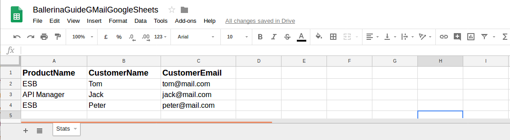

# Reading Google Sheet and Messaging with GMail

Google Sheet is an online spreadsheet that lets users create and format spreadsheets and simultaneously work with other 
people. Gmail is a free, Web-based e-mail service provided by Google.

> This guide walks you through the process of using Google Sheets and GMail using Ballerina language.

The following are the sections available in this guide.

- [What you'll build](#what-you-build)
- [Prerequisites](#pre-req)
- [Developing the application](#develop-app)
- [Testing](#testing)

## <a name="what-you-build"></a>  What you’ll build

To understand how you can use Ballerina API Connectors,  in this sample we use GMail connector and Google Spreadsheet 
connector. Let us consider a real world use case scenario of a software product company. When a customer downloads the 
product from the company website, providing the name and email address, the company sends a customized email to the 
customer’s mailbox saying,

    Hi <CustomerName>
    
    Thank you for downloading the product <ProductName> !

    If you still have questions regarding <ProductName>, please contact us and we will get in touch with you right away !                                        

The product name is added to the first column and customer name and email address are added to the second and third 
column of a Google Sheet.

You can use the Ballerina Google Spreadsheet connector to read the spreadsheet, iterate through the rows and picking 
up the product name, email address and name of each customer from the columns. Then you can use the GMail connector 
to simply add the name to the body of a standard-html-mail template and send the email to the relevant customer.

## <a name="pre-req"></a> Prerequisites
 
- JDK 1.8 or later

- [Ballerina Distribution](https://ballerinalang.org/docs/quick-tour/quick-tour/#install-ballerina) 

- A Text Editor or an IDE
    - Optional requirement : Ballerina IDE plugins (IntelliJ IDEA, VSCode, Atom)
    
- Obtain following tokens and credentials for both Google Sheets and GMail APIs. 
    * Client Id
    * Client Secret
    * Access Token
    * Refresh Token <br/>
        
      For that, go through the following steps.      
        * First, create an application to connect with Gmail API and Google Sheets
        * For that, visit Google APIs console (https://console.developers.google.com/) to create a project and create 
        an app for the project
        * After creating the project, configure the OAuth consent screen under Credentials and give a product name to 
            shown to users.
        * Then create OAuth client ID credentials. (Select webapplication -> create and give a name and a redirect URI
            (To get the authorization code to requests tokens for the enabled apis) -> create).
    
        (Give the redirect URI as (https://developers.google.com/oauthplayground), if you are using OAuth2 playground to
         obtain access token and refresh token)
        * Visit OAuth 2.0 Playground (https://developers.google.com/oauthplayground/), select the following api scopes, 
          give the obtained client id and client secret and obtain the refresh token and access token.
            * https://mail.google.com
            * https://spreadsheets.google.com/feeds/
            
- Create a google sheet as following from the same google account you have obtained the client credentials and tokens 
to access both apis.



- Obtain the spreadsheet id by extracting the value between the "/d/" and the "/edit" in the URL of your spreadsheet.

## <a name="develop-app"></a> Developing the application
### <a name="before-begin"></a> Before you begin
##### Understand the package structure

Ballerina is a complete programming language that can have any custom project structure as you wish. Although language 
allows you to have any package structure, we'll stick with the following package structure for this project.

```
gmail-spreadsheet-integration
  ├── ballerina.conf  
  └── src
      └── integrationSystem
          ├── gmail-client.bal
          ├── gsheets-client.bal
          ├── integration.bal
          ├── utils.bal
```

##### Change the configurations in the `ballerina.conf` file

You will need to configure the `ballerina.conf` configuration file with the above obtained tokens, credentials and 
other important parameters as follows.

###### ballerina.conf
```ballerina.conf
ACCESS_TOKEN="enter your access token here"
CLIENT_ID="enter your client id here"
CLIENT_SECRET="enter your client secret here"
REFRESH_TOKEN="enter your refresh token here"

SPREADSHEET_ID="enter the reference spreadsheet id"
SHEET_NAME="enter the reference spreadsheet name"
SENDER="enter email sender address"
USER_ID="enter the user id. give special value 'me' for the authorized user"
```
- SPREADSHEET_ID is the spreadsheet id you have extracted from the sheet url.
- SHEET_NAME is the sheet name of your google sheet. For example in above example, SHEET_NAME="Stats"
- SENDER is the email address of the sender.
- USER_ID is the email address of the authorized user. You can give this value as **me**.

### <a name="Implementation"></a> Implementation

Let's see how both of these Ballerina connectors can be used for this sample use case. 

First let's look at gsheets-client.bal file to create the googlespreadsheet client endpoint as follows.
```ballerina
endpoint gsheets:Client spreadsheetEP {
    oAuth2ClientConfig: {
        accessToken:accessToken,
        clientConfig:{},
        refreshToken:refreshToken,
        clientId:clientId,
        clientSecret:clientSecret,
        useUriParams:true
    }
};
```
Next, let's look at gmail-client.bal file to create the gMail client endpoint as follows.
```ballerina
endpoint gmail:Client gMailEP {
    oAuth2ClientConfig:{
        accessToken:accessToken,
        clientId:clientId,
        clientSecret:clientSecret,
        refreshToken:refreshToken
    }
};
```
Note that, inside utils.bal, above each endpoint configuration parameters are read from the ballerina.conf file.

After creating the endpoints, let's implemented the api calls inside the functions **getCustomerDetailsFromGSheet()** in 
gsheets-client.bal and **sendMail()** in gmail-client.bal.

Let's look at how to get the sheet data about customer product downloads.
```ballerina
function getCustomerDetailsFromGSheet () returns (string[][]) {
    string[][] values = [];
    var spreadsheetRes = spreadsheetEP -> getSheetValues(spreadsheetId, sheetName, "", "");

    match spreadsheetRes {
        string[][] vals => values = vals;
        gsheets:SpreadsheetError e => log:printInfo(e.errorMessage);
    }
    return values;
}
```
The spreadsheet connector's **getSheetValues()** function is called from spreadsheet endpoint by passing only the 
spreadsheet id and the sheet name. The sheet values are returned to a two dimensional string array.

Next let's look at how to send an email using the GMail connector endpoint.
```ballerina
function sendMail(string recipient, string productName, string messageBody) {
    //---Create the html message---
    string subject = "Thank You for Downloading " + productName;
    gmail:MessageOptions options = {};
    options.sender = senderEmail;
    gmail:Message mail = new gmail:Message();
    match mail.createHTMLMessage(recipient, subject, messageBody, options, []){
        gmail:GMailError e => log:printInfo(e.errorMessage);
        () => {
            //----Send the mail----
            log:printInfo("gMailEP -> sendMessage()");
            var sendMessageResponse = gMailEP -> sendMessage(userId, mail);
            string messageId;
            string threadId;
            match sendMessageResponse {
                (string, string) sendStatus => {
                    (messageId, threadId) = sendStatus;
                    log:printInfo("Sent message Id: " + messageId);
                    log:printInfo("Send thread Id:" + threadId);
                }
                gmail:GMailError e => log:printInfo(e.errorMessage);
            }
        }
    }
}
```
First, a new Message type object is created and its function **createHTMLMessage()** is called by passing the recipient 
(customer email address), subject of the mail, html message body of the mail, mail options including from, cc, bcc 
fields and an InlineImage type array.
Since we are not using inline images in our mail, we pass an empty array as the last argument.

Next, the GMail connector's **sendMessage()** function is called from the gMail endpoint by passing the user id 
(default:me) and the created Message type object. Note that, for a successful message send request, the sent message id and
thread id are returned in the response.

By using the above, the main function in integration.bal is need to be written to get customer details from the sheet 
by first calling **getCustomerDetailsFromGSheet()**. Then the rows in the returned sheet is iterated. During the
iteration, cell values in the first three columns are extracted for each row, except for the first row with column 
headers. During the iteration, a custom html mail is created and sent for each customer.

```ballerina
public function main(string[] args) {
    //Retrieve the user details from spreadsheet
    log:printInfo("Started to retrieve customer details from spreadsheet id:" + spreadsheetId + " ;spreasheet name: "
            + sheetName);
    string[][] values = getCustomerDetailsFromGSheet();
    int i = 1;
    //Iterate each row of the sheet, extract details and send customized email to each customer
    foreach value in values {
        //Skip the first row with column headers in the sheet
        if (i > 1) {
            string productName = value[0];
            log:printInfo("Reading sheet row : " + i + " ProductName column value : " + productName);
            string customerName = value[1];
            log:printInfo("Reading sheet row : " + i + " CutomerName column value : " + customerName);
            string customerEmail = value[2];
            log:printInfo("Reading sheet row : " + i + " CustomerEmail column value : " + customerEmail);

            string customMessage = getCustomEmailFromTemplate(customerName, productName);
            log:printInfo("Sending custom email to: " + customerEmail + " with message: " + customMessage);
            sendMail(customerEmail, productName, customMessage);
        }
        i += 1;
    }
}
```
To see the complete implementation refer integrationSystem package.

## <a name="testing"></a> Testing 

### <a name="try-out"></a> Try it out

Run this sample by entering the following command in a terminal,

```bash
<SAMPLE_ROOT_DIRECTORY>/src$ ballerina run integrationSystem
```

#### <a name="response"></a> Response you'll get

The mailboxes of the customers, included in your google sheet, would receive a new customized email with the 
**Subject : Thank You for Downloading {ProductName}**

Let's now look at sample log statements we will get as the response for this scenario.

```ballerina
INFO  [integrationSystem] - Started to retrieve customer details from spreadsheet id:1AH8-khPiF1dBFAs_MV5AiGDcdwFUkxOMq5ZRgBnkPW0 ;spreasheet name: Stats 
INFO  [integrationSystem] - Reading sheet row : 2 ProductName column value : ESB 
INFO  [integrationSystem] - Reading sheet row : 2 CutomerName column value : Tom 
INFO  [integrationSystem] - Reading sheet row : 2 CustomerEmail column value : tom@mail.com 
INFO  [integrationSystem] - Sending custom email to: tom@mail.com with message: <h2> Hi Tom </h2><h3> Thank you for downloading the product ESB ! </h3><p> If you still have questions regarding ESB, please contact us and we will get in touch with you right away ! </p>  
INFO  [integrationSystem] - gMailEP -> sendMessage() 
INFO  [integrationSystem] - Sent message Id: 162b67bc901b6860 
INFO  [integrationSystem] - Send thread Id:162b67bc901b6860 
INFO  [integrationSystem] - Reading sheet row : 3 ProductName column value : API Manager 
INFO  [integrationSystem] - Reading sheet row : 3 CutomerName column value : Jack 
INFO  [integrationSystem] - Reading sheet row : 3 CustomerEmail column value : jack@mail.com 
INFO  [integrationSystem] - Sending custom email to: jack@mail.com with message: <h2> Hi Jack </h2><h3> Thank you for downloading the product API Manager ! </h3><p> If you still have questions regarding API Manager, please contact us and we will get in touch with you right away ! </p>  
INFO  [integrationSystem] - gMailEP -> sendMessage() 
INFO  [integrationSystem] - Sent message Id: 162b67bcce9247bf 
INFO  [integrationSystem] - Send thread Id:162b67bcce9247bf 
INFO  [integrationSystem] - Reading sheet row : 4 ProductName column value : ESB 
INFO  [integrationSystem] - Reading sheet row : 4 CutomerName column value : Peter 
INFO  [integrationSystem] - Reading sheet row : 4 CustomerEmail column value : peter@mail.com 
INFO  [integrationSystem] - Sending custom email to: peter@mail.com with message: <h2> Hi Peter </h2><h3> Thank you for downloading the product ESB ! </h3><p> If you still have questions regarding ESB, please contact us and we will get in touch with you right away ! </p>  
INFO  [integrationSystem] - gMailEP -> sendMessage() 
INFO  [integrationSystem] - Sent message Id: 162b67bce1cb4d28 
INFO  [integrationSystem] - Send thread Id:162b67bce1cb4d28 
```
