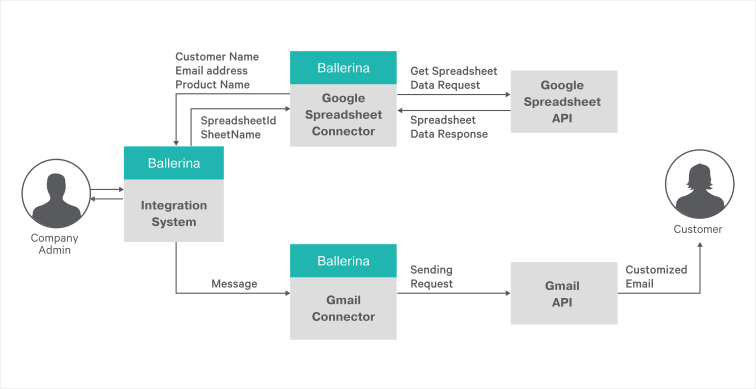
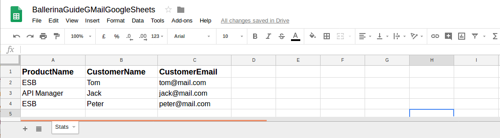

# Reading Google Sheet and Messaging with GMail

Google Sheets is an online spreadsheet that lets users to create and format spreadsheets and simultaneously work with other 
people. Gmail is a free, web-based e-mail service provided by Google.

> This guide walks you through the process of using Google Sheets and GMail using Ballerina language.

The following are the sections available in this guide.

- [What you'll build](#what-you-build)
- [Prerequisites](#pre-req)
- [Developing the application](#develop-app)
- [Testing](#testing)

## <a name="what-you-build"></a>  What you’ll build

To understand how you can use Ballerina API connectors, in this sample we use _GMail connector_ and _Google Spreadsheet_ 
connector. Let us consider a real world use case scenario of a software product company. When a customer downloads the 
product from the company website, providing the name and email address, the company sends a customized email to the 
customer’s mailbox saying,

    Hi <CustomerName>
    
    Thank you for downloading the product <ProductName> !

    If you still have questions regarding <ProductName>, please contact us and we will get in touch with you right away !                                        

The product name, customer name and email address are added to the first, second and third columns of a Google Sheet.



You can use the Ballerina Google Spreadsheet connector to read the spreadsheet, iterate through the rows and pick 
up the product name, email address and name of each customer from the columns. Then you can use the GMail connector 
to simply add the name to the body of a html mail template and send the email to the relevant customer.

## <a name="pre-req"></a> Prerequisites
 
- JDK 1.8 or later

- [Ballerina Distribution](https://ballerinalang.org/docs/quick-tour/quick-tour/#install-ballerina) 

- A Text Editor or an IDE
    - Optional requirement : Ballerina IDE plugins (IntelliJ IDEA, VSCode, Atom)
    
- Obtain following tokens and credentials for both Google Sheets and GMail APIs. 
    * Client Id
    * Client Secret
    * Access Token
    * Refresh Token <br/>
        
      For that, go through the following steps.      
        * First, create an application to connect with Gmail API and Google Sheets.
        * For that, visit Google APIs console (https://console.developers.google.com/) to create a project and create 
        an app for the project.
        * After creating the project, configure the OAuth consent screen under Credentials and give a product name to 
            shown to users.
        * Then create OAuth client ID credentials. (Select webapplication -> create and give a name and a redirect URI
            (To get the authorization code to requests tokens for the enabled apis) -> create).
    
        (Give the redirect URI as (https://developers.google.com/oauthplayground), if you are using OAuth2 playground to
         obtain access token and refresh token)
        * Visit OAuth 2.0 Playground (https://developers.google.com/oauthplayground/), select the following api scopes, 
          give the obtained client id and client secret and obtain the refresh token and access token.
            * https://mail.google.com
            * https://spreadsheets.google.com/feeds/
            
- Create a Google Sheet as following from the same Google account you have obtained the client credentials and tokens 
to access both APIs.



- Obtain the spreadsheet id by extracting the value between the "/d/" and the "/edit" in the URL of your spreadsheet.

## <a name="develop-app"></a> Developing the application
### <a name="before-begin"></a> Before you begin
##### Understand the package structure

Ballerina is a complete programming language that can have any custom project structure as you wish. Although language 
allows you to have any package structure, we'll stick with the following simple package structure for this project.

```
gmail-spreadsheet-integration
  ├── ballerina.conf  
  └── integrationSystem
      └── notification_sender.bal
```

##### Change the configurations in the `ballerina.conf` file

You will need to configure the `ballerina.conf` configuration file with the above obtained tokens, credentials and 
other important parameters as follows.

###### ballerina.conf
```ballerina.conf
ACCESS_TOKEN="enter your access token here"
CLIENT_ID="enter your client id here"
CLIENT_SECRET="enter your client secret here"
REFRESH_TOKEN="enter your refresh token here"

SPREADSHEET_ID="enter the reference spreadsheet id"
SHEET_NAME="enter the reference spreadsheet name"
SENDER="enter email sender address"
USER_ID="enter the user id. give special value 'me' for the authorized user"
```
- SPREADSHEET_ID is the spreadsheet id you have extracted from the sheet url.
- SHEET_NAME is the sheet name of your Goolgle Sheet. For example in above example, SHEET_NAME="Stats"
- SENDER is the email address of the sender.
- USER_ID is the email address of the authorized user. You can give this value as **me**.

### <a name="Implementation"></a> Implementation

Let's see how both of these Ballerina connectors can be used for this sample use case. 

First let's look at how to create the _googlespreadsheet client endpoint_ as follows.
```ballerina
endpoint gsheets4:Client spreadsheetEP {
    clientConfig: {
        auth:{
            accessToken:accessToken,
            refreshToken:refreshToken,
            clientId:clientId,
            clientSecret:clientSecret
        }
    }
};
```
Next, let's look at how to create the gMail client endpoint as follows.
```ballerina
endpoint Client gMailEP {
    clientConfig:{
        auth:{
            accessToken:accessToken,
            clientId:clientId,
            clientSecret:clientSecret,
            refreshToken:refreshToken
        }
    }
};
```
Note that, in the implementation, each of the above endpoint configuration parameters are read from the `ballerina.conf` file.

After creating the endpoints, let's implement the API calls inside the functions **getCustomerDetailsFromGSheet()** 
and **sendMail()**.

Let's look at how to get the sheet data about customer product downloads as follows.
```ballerina
function getCustomerDetailsFromGSheet () returns (string[][]) {
    string[][] values = [];
    //Read all the values from the sheet.
    var spreadsheetRes = spreadsheetEP -> getSheetValues(spreadsheetId, sheetName, "", "");
    match spreadsheetRes {
        string[][] vals => values = vals;
        gsheets4:SpreadsheetError e => log:printInfo(e.errorMessage);
    }
    return values;
}
```
The spreadsheet connector's **getSheetValues()** function is called from spreadsheet endpoint by passing only the 
spreadsheet id and the sheet name. The sheet values are returned as a two dimensional string array.

Next, let's look at how to send an email using the GMail connector endpoint.
```ballerina
function sendMail(string customerEmail, string subject, string messageBody) {
    //Create html message
    gmail:MessageOptions options = {};
    options.sender = senderEmail;
    gmail:Message mail = new gmail:Message();
    match mail.createHTMLMessage(customerEmail, subject, messageBody, options, []){
        gmail:GMailError e => log:printInfo(e.errorMessage);
        () => {
            //Send mail
            var sendMessageResponse = gMailEP -> sendMessage(userId, mail);
            string messageId;
            string threadId;
            match sendMessageResponse {
                (string, string) sendStatus => {
                    (messageId, threadId) = sendStatus;
                    log:printInfo("Sent email to " + customerEmail + "with message Id: " + messageId + " and thread Id:"
                            + threadId);
                }
                gmail:GMailError e => log:printInfo(e.errorMessage);
            }
        }
    }
}
```
First, a new Message type object is created and its function **createHTMLMessage()** is called by passing the recipient 
(customer email address), subject of the mail, html message body of the mail, mail options including from, cc, bcc 
fields and an InlineImage type array.
Since we are not using inline images in our mail, we have passed an empty array as the last argument.

Next, the GMail connector's **sendMessage()** function is called from the gMail endpoint by passing the user id 
(default:me) and the created Message type object. The sent message id and thread id are returned in the response for a 
successful message send request. 

The main function in _notification_sender.bal_ calls **sendNotification()**. Inside **sendNotification()**, the customer 
details are taken from the sheet by first calling **getCustomerDetailsFromGSheet()**. Then, the rows in the returned 
sheet are iterated. During each iteration, cell values in the first three columns are extracted for each row, except for 
the first row with column headers, and during each iteration, a custom html mail is created and sent for each customer.

```ballerina
function sendNotification() {
    //Retrieve the customer details from spreadsheet.
    string[][] values = getCustomerDetailsFromGSheet();
    int i =0;
    //Iterate through each customer details and send customized email.
    foreach value in values {
        //Skip the first row as it contains header values.
        if(i > 0) {
            string productName = value[0];
            string CutomerName = value[1];
            string customerEmail = value[2];
            string subject = "Thank You for Downloading " + productName;
            sendMail(customerEmail, subject, getCustomEmailTamplate(CutomerName, productName));
        }
        i = i +1;
    }
}
```

## <a name="testing"></a> Testing 

### <a name="try-out"></a> Try it out

Run this sample by entering the following command in a terminal,

```bash
<SAMPLE_ROOT_DIRECTORY>/src$ ballerina run integrationSystem
```

#### <a name="response"></a> Response you'll get

Each of the customers in your Google Sheet, would receive a new customized email with the 
**Subject : Thank You for Downloading {ProductName}**

Let's now look at sample log statements we will get when running the sample for this scenario.

```ballerina
INFO  [integrationSystem] - Retrieved customer details from spreadsheet id:1AH8-khPiF1dBFAs_MV5AiGDcdwFUkxOMq5ZRgBnkPW0 ;sheet name: Stats 
INFO  [integrationSystem] - Sent email to tom@mail.com with message Id: 162b8e298adac15c and thread Id:162b8e298adac15c 
INFO  [integrationSystem] - Sent email to jack@mail.com with message Id: 162b8e29ac7da1da and thread Id:162b8e29ac7da1da 
INFO  [integrationSystem] - Sent email to peter@mail.com with message Id: 162b8e29edd1e593 and thread Id:162b8e29edd1e593 
```
